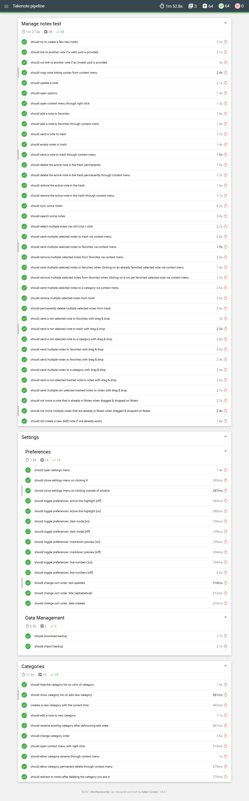

<p align="center">
  
</p>

<p align="center">
 
   <a href="https://app.netlify.com/sites/tnote/deploys"></a>
   <a href='https://coveralls.io/github/taniarascia/takenote'></a>
 </p>
 <p align="center">
   <a href="https://sonarcloud.io/dashboard?id=taniarascia_takenote"></a>
   <a href="https://sonarcloud.io/dashboard?id=taniarascia_takenote"></a>
   <a href="https://sonarcloud.io/api/project_badges/measure?project=taniarascia_takenote&metric=security_rating"></a>
   
</p>

<p align="center">A web-based notes app for developers. (Demo only)</p>


## Features

- **Plain text notes** - take notes in an IDE-like environment that makes no assumptions
- **Markdown preview** - view rendered HTML
- **Linked notes** - use `{{uuid}}` syntax to link to notes within other notes
- **Syntax highlighting** - light and dark mode available (based on the beautiful [New Moon theme](https://taniarascia.github.io/new-moon/))
- **Keyboard shortcuts** - use the keyboard for all common tasks - creating notes and categories, toggling settings, and other options
- **Drag and drop** - drag a note or multiple notes to categories, favorites, or trash
- **Multi-cursor editing** - supports multiple cursors and other [Codemirror](https://codemirror.net/) options
- **Search notes** - easily search all notes, or notes within a category
- **Prettify notes** - use Prettier on the fly for your Markdown
- **No WYSIWYG** - made for developers, by developers
- **No database** - notes are only stored in the browser's local storage and are available for download and export to you alone
- **No tracking or analytics** - 'nuff said
- **GitHub integration** - self-hosted option is available for auto-syncing to a GitHub repository (not available in the demo)

## About

TakeNote is a note-taking app for the web. You can use the demo app at [takenote.dev](https://takenote.dev). It is a static site without a database and does not sync your notes to the cloud. The notes are persisted temporarily in local storage, but you can download all notes in markdown format as a zip.

Hidden within the code is an alternate version that contain a Node/Express server and integration with GitHub. This version involves creating an OAuth application for GitHub and signing up to it with private repository permissions. Instead of backing up to local storage, your notes will back up to a private repository in your account called `takenote-data`. Due to the following reasons I'm choosing not to deploy or maintain this portion of the application:

- I do not want to maintain a free app with users alongside my career and other commitments
- I do not want to request private repository permissions from users
- I do not want to maintain an active server
- I do not want to worry about GitHub rate limiting from the server
- There is no way to batch create many files from the GitHub API, leading to a suboptimal GitHub storage solution

However, I'm leaving the code available so you can feel free to host your own TakeNote instance or study the code for learning purposes. I do not provide support or guidance for these purposes.

TakeNote was created with TypeScript, React, Redux, Node, Express, Codemirror, Webpack, Jest, Cypress, Feather Icons, ESLint, and Mousetrap, among other awesome open-source software.

## Reviews

> _"I think the lack of extra crap is a feature."_ — Craig Lam

## Demo Development

Clone and install.

```bash
git clone git@github.com:taniarascia/takenote
cd takenote
npm i
```

Run a development server.

```bash
npm run client
```

## Full Application Development (self-hosted)

### Pre-Installation

Before working on TakeNote locally, you must create a GitHub OAuth app for development.

Go to your GitHub profile settings, and click on **Developer Settings**.

Click the **New OAuth App** button.

- **Application name**: TakeNote Development
- **Homepage URL**: `http://localhost:3000`
- **Authorization callback URL**: `http://localhost:3000/api/auth/callback`

Create a `.env` file in the root of the project, and add the app's client ID and secret. Remove `DEMO` variable to enable GitHub integration.

```bash
CLIENT_ID=xxx
CLIENT_SECRET=xxxx
DEMO=true
```

> Change the URLs to port `5000` in production mode or Docker.

### Installation

```bash
git clone git@github.com:taniarascia/takenote
cd takenote
npm i
```

#### Development mode

In the development environment, an Express server is running on port `5000` to handle all API calls, and a hot Webpack dev server is running on port `3000` for the React frontend. To run both of these servers concurrently, run the `dev` command.

```bash
npm run dev
```

Go to `localhost:3000` to view the app.

> API requests will be proxied to port `5000` automatically.

#### Production mode

In the production environment, the React app is built, and Express redirects all incoming requests to the `dist` directory on port `5000`.

```bash
npm run build && npm run start
```

Go to `localhost:5000` to view the app.

#### Run in Docker

Follow these instructions to build an image and run a container.

```bash
# Build Docker image
docker build --build-arg CLIENT_ID=xxx -t takenote:mytag .

# Run Docker container in port 5000
docker run \
-e CLIENT_ID=xxx \
-e CLIENT_SECRET=xxxx \
-e NODE_ENV=development \
-p 5000:5000 \
takenote:mytag
```

Go to `localhost:5000` to view the app.

> Note: You will see some errors during the installation phase, but these are simply warnings that unnecessary packages do not exist, since the Node Alpine base image is minimal.

### Seed data

To seed the app with some test data, paste the contents of `seed.js` into your browser console.

## Testing

Run unit and component/integration tests.

```bash
npm run test
```

> If using Jest Runner in VSCode, add `"jestrunner.configPath": "config/jest.config.js"` to your settings

Run Cypress end-to-end tests.

```bash
# In one window, run the application
npm run client

# In another window, run the end-to-end tests
npm run test:e2e:open
```

## Contributing

TakeNote is an open source project, and contributions of any kind are welcome and appreciated. Open issues, bugs, and feature requests are all listed on the [issues](https://github.com/taniarascia/takenote/issues) tab and labeled accordingly. Feel free to open bug tickets and make feature requests. Easy bugs and features will be tagged with the `good first issue` label.

View [CONTRIBUTING.md](CONTRIBUTING.md) to learn about the style guide, folder structure, scripts, and how to contribute.

## Contributors

Thanks goes to these wonderful people:

<!-- ALL-CONTRIBUTORS-LIST:START - Do not remove or modify this section -->
<!-- prettier-ignore-start -->
<!-- markdownlint-disable -->
<table>
  <tr>
    <td align="center"><a href="https://github.com/reqhiem"><br /><sub><b>Joel Perca</b></sub></a><br /><a href="https://github.com/reqhiem" title="Code">
    <td align="center"><a href="https://github.com/MisaelVM"><br /><sub><b>Misael Svante</b></sub></a><br /><a href="https://github.com/MisaelVM" title="Code">
    </td>
    <td align="center"><a href="https://github.com/ElizabethYasmin"><br /><sub><b>Elizabeth Yasmin</b></sub></a><br /><a href="https://github.com/ElizabethYasmin" title="Code">
    <td align="center"><a href="https://github.com/EdgarEspinozaPE"><br /><sub><b>Edgar Alfonso</b></sub></a><br /><a href="https://github.com/EdgarEspinozaPE" title="Code">
    </td>
    <td align="center"><a href="https://github.com/ImaMos01"><br /><sub><b>Imanol Brayan</b></sub></a><br /><a href="https://github.com/ImaMos01" title="Code">
    </td>
    <td align="center"><a href="https://github.com/GabrielArana0220"><br /><sub><b>Gabriel Adriano</b></sub></a><br /><a href="https://github.com/GabrielArana0220" title="Code">
    </td>
  </tr>
</table>

<!-- markdownlint-restore -->
<!-- prettier-ignore-end -->

<!-- ALL-CONTRIBUTORS-LIST:END -->

## Acknowledgements

- A big thank you to [David Bock](https://dkbock.com/) for logo design.

## Author

- [Tania Rascia](https://www.taniarascia.com)

## License

This project is open source and available under the [MIT License](LICENSE).

---

# Arquitectura de Integración Continua/Despliegue Continuo (CI/CD)

El presente repositorio corresponde a la implementación de la arquitectura de CI/CD como parte del curso de Ingeniería de Software II de la carrera de Ciencia de la Computación en la Universidad Nacional de San Agustín de Arequipa.

## Informes y reportes

<a href="docs/pdfs/IS2_Parcial03_informe.pdf">Informe CI/CD pipeline</a>

<a href="docs/pdfs/IS2_Parcial03_Plan_de_pruebas.pdf">Plan de pruebas</a>

<a href="docs/pdfs/IS2_Parcial03_Reporte_plan_pruebas.pdf">Reporte de plan de pruebas</a>

## Tecnologías usadas

1. Lenguajes de programación: TypeScript, JavaScript, etc:

2. Jenkins para la integración de las diferentes herramientas `http://localhost:8080/`.

3. SonarQube para el análisis estático de código, ejecutándose en `http://localhost:9000/`.

4. NodeJS como entorno de ejecución para el lenguaje JavaScript y TypeScript.

5. NPM para manipular los paquetes de Node además de permitir la construcción.

6. Git para el manejo de versiones y trabajo colaborativo.

7. IDE VSCode con sus extensiones de soporte para Docker.

8. Jest, Cypress para las pruebas unitarias así como para las end-to-end testing.

9. Docker para contenerización.
10. OWASP ZAP CLI y JMeter para las pruebas de seguridad y performance respectivamente.

## Pipeline

```Jenkinsfile
pipeline {
    agent any
    stages {
        stage('Construccion') {
            steps {
                echo "Instalando dependencias..."
                powershell "npm install"

                echo "Compilando la aplicacion..."
                powershell "npm run build"
            }
        }
        stage('Analisis estatico') {
            steps {
                echo 'SonarQube...'
                withSonarQubeEnv('SonarQube') {
                    bat "C:\\sonar\\sonar-scanner\\bin\\sonar-scanner.bat"
                }
            }
        }
        stage('Pruebas unitarias') {
            steps {
                echo 'Ejecutando pruebas unitarias...'
                powershell "npm run test"
                echo "Generando reporte de pruebas..."
                echo "Publicando reporte de pruebas..."
                publishHTML (target: [
                    allowMissing: false,
                    alwaysLinkToLastBuild: false,
                    keepAll: true,
                    reportDir: 'reports/jest',
                    reportFiles: 'test-report.html',
                    reportName: "Reporte de pruebas unitarias",
                ])
            }
        }

        stage('Pruebas funcionales') {
            steps {
                echo 'Ejecutando pruebas funcionales...'
                powershell "rmdir -r mochawesome-report"
                powershell "npm run test:e2e"

                echo "Generando reporte de pruebas..."
                powershell "npm run create:html:report"

                echo "Publicando reporte..."
                publishHTML (target: [
                    allowMissing: false,
                    alwaysLinkToLastBuild: false,
                    keepAll: true,
                    reportDir: 'mochawesome-report',
                    reportFiles: 'cypress-combined-report.html',
                    reportName: "Reporte de pruebas funcionales",
                ])
            }
        }

        stage('Pruebas de seguridad') {
            steps {
                echo "OWASP Security Tests"
                powershell "cd E:\\dev\\is\\ZAP; ./zap.bat -cmd -quickurl http://localhost:3000/ -quickout E:\\dev\\is\\test\\reportForDVWA.html"

                echo "Publicando reporte"

                publishHTML (target: [
                    allowMissing: false,
                    alwaysLinkToLastBuild: false,
                    keepAll: true,
                    reportDir: 'E:\\dev\\is\\test\\',
                    reportFiles: 'reportForDVWA.html',
                    reportName: "OWASP ZAP Report",
                ])
            }
        }
        stage('Pruebas de Performance') {
            steps {
                echo "Performance Tests"
                bat "C:\\jmeter\\bin\\jmeter -n -t E:\\dev\\is\\test\\takenote_jmeter.jmx -l E:\\dev\\is\\test\\takenote_jmeter_report.jtl"

                perfReport "E:\\dev\\is\\test\\takenote_jmeter_report.jtl"

            }
        }
    }
}

```

## Construcción automática

Para la etapa de la construcción automática se emplea el gestor de paquetes y construcción de NodeJS llamada NPM. Esta se basa en un archivo de JSON para declarar todas las características del proyecto así como los comandos soportados, con nombre de archivo **package.json**.

```json
{
  "name": "takenote",
  "version": "0.7.2",
  "description": "A web-based notes app for developers.",
  "author": "Pocho's Inc.",
  "license": "MIT",
  "private": false,
  "main": "src/server/index.ts",
  "scripts": {
    "dev": "concurrently \"npm run server\" \"npm run client\"",
    "client": "cross-env NODE_ENV=development webpack serve --config config/webpack.dev.js",
    "server": "nodemon --config config/nodemon.config.json",
    "build": "cross-env NODE_ENV=production webpack --config config/webpack.prod.js",
    "prod": "node -r ts-node/register/transpile-only src/server/index.ts",
    "start": "npm run client",
    "test": "jest --config config/jest.config.js",
    "test:e2e": "cypress run --config-file config/cypress.config.json",
    "test:e2e:open": "cypress open --config-file config/cypress.config.json",
    "test:coverage": "jest --config config/jest.config.js --coverage --watchAll=false",
    "test:coverage:ci": "jest --config config/jest.config.js --ci --coverage --watchAll=false && cat ./coverage/lcov.info | coveralls",
    "format": "prettier --write \"./**/*.{js,jsx,ts,tsx,css,scss,md}\"",
    "eslint": "eslint src/**/*.{ts,tsx}",
    "merge:reports": "mochawesome-merge mochawesome-report/*.json > cypress-combined-report.json",
    "create:html:report": "npm run merge:reports && marge -reportDir TestReport cypress-combined-report.json"
  },
  "repository": {
    "type": "git",
    "url": "git+https://github.com/reqhiem/takenote"
  },
  "keywords": [
    "notes",
    "notes-app",
    "note-taking",
    "markdown",
    "markdown-editor",
    "redux",
    "react",
    "typescript",
    "react-hooks",
    "react-hooks-redux",
    "github"
  ],
  "bugs": {
    "url": "Jira: https://reqhiem.atlassian.net/projects/REQHIEM/issues"
  },
  "homepage": "https://takenote.dev",
  "husky": {
    "hooks": {
      "pre-commit": "lint-staged"
    }
  },
  "lint-staged": {
    "**/*.{js,jsx,ts,tsx}": ["eslint --fix"],
    "**/*.{json,css,scss,md}": ["prettier --write"]
  },
  "dependencies": {
    "@reduxjs/toolkit": "^1.4.0",
    "axios": "^0.21.1",
    "clipboard-polyfill": "^3.0.1",
    "codemirror": "^5.58.1",
    "compression": "^1.7.4",
    "cookie-parser": "^1.4.5",
    "cors": "^2.8.5",
    "dayjs": "^1.9.3",
    "express": "^4.17.1",
    "helmet": "^4.1.1",
    "jest-html-reporter": "^3.4.2",
    "jszip": "^3.5.0",
    "mousetrap": "^1.6.5",
    "mousetrap-global-bind": "^1.1.0",
    "path-browserify": "^1.0.1",
    "prettier": "^2.1.2",
    "process": "^0.11.10",
    "react": "^16.14.0",
    "react-beautiful-dnd": "^13.0.0",
    "react-codemirror2": "^7.2.1",
    "react-device-detect": "^1.14.0",
    "react-dom": "^16.14.0",
    "react-feather": "^2.0.8",
    "react-helmet-async": "^1.0.7",
    "react-markdown": "^4.3.1",
    "react-redux": "^7.2.1",
    "react-router-dom": "^5.2.0",
    "react-split-pane": "^0.1.92",
    "redux": "^4.0.5",
    "redux-saga": "^1.1.3",
    "stream-browserify": "^3.0.0",
    "unist-util-visit": "^2.0.3",
    "uuid": "^8.3.1"
  },
  "devDependencies": {
    "@cypress/webpack-preprocessor": "^5.4.8",
    "@testing-library/cypress": "^7.0.1",
    "@testing-library/jest-dom": "^5.11.4",
    "@testing-library/react": "^11.1.0",
    "@types/axios": "^0.14.0",
    "@types/codemirror": "0.0.98",
    "@types/compression": "^1.7.0",
    "@types/cookie-parser": "^1.4.2",
    "@types/cors": "^2.8.8",
    "@types/express": "^4.17.8",
    "@types/faker": "^5.1.2",
    "@types/helmet": "0.0.48",
    "@types/jest": "^26.0.14",
    "@types/jszip": "^3.4.1",
    "@types/lodash": "^4.14.162",
    "@types/node": "^14.11.8",
    "@types/prettier": "^2.1.3",
    "@types/react": "^16.9.52",
    "@types/react-beautiful-dnd": "^13.0.0",
    "@types/react-dom": "^16.9.8",
    "@types/react-helmet-async": "^1.0.3",
    "@types/react-redux": "^7.1.9",
    "@types/react-router": "^5.1.8",
    "@types/react-router-dom": "^5.1.6",
    "@types/testing-library__cypress": "^5.0.8",
    "@types/uuid": "^8.3.0",
    "@typescript-eslint/eslint-plugin": "^4.4.1",
    "@typescript-eslint/parser": "^4.4.1",
    "clean-webpack-plugin": "^3.0.0",
    "clipboardy": "^2.3.0",
    "concurrently": "^5.3.0",
    "copy-webpack-plugin": "^6.2.1",
    "coveralls": "^3.1.0",
    "cross-env": "^7.0.2",
    "css-loader": "^5.0.0",
    "css-minimizer-webpack-plugin": "^1.1.5",
    "cypress": "^5.4.0",
    "cypress-file-upload": "^4.1.1",
    "dotenv": "^8.2.0",
    "eslint": "^7.11.0",
    "eslint-config-prettier": "^6.13.0",
    "eslint-import-resolver-alias": "^1.1.2",
    "eslint-plugin-import": "^2.22.1",
    "eslint-plugin-prettier": "^3.1.4",
    "eslint-plugin-react": "^7.21.4",
    "faker": "^5.1.0",
    "html-webpack-plugin": "^5.0.0-alpha.7",
    "husky": "^4.3.0",
    "image-webpack-loader": "^7.0.1",
    "jest": "^26.5.3",
    "jest-extended": "^0.11.5",
    "jest-raw-loader": "^1.0.1",
    "lint-staged": "^10.4.1",
    "mini-css-extract-plugin": "^1.0.0",
    "mocha": "^9.1.3",
    "mochawesome": "^7.0.1",
    "mochawesome-merge": "^4.2.1",
    "mochawesome-report-generator": "^6.0.1",
    "node-sass": "^4.14.1",
    "nodemon": "^2.0.5",
    "sass-loader": "^10.0.3",
    "style-loader": "^2.0.0",
    "ts-jest": "^26.4.1",
    "ts-loader": "^8.0.5",
    "ts-node": "^9.0.0",
    "typescript": "^4.0.3",
    "webpack": "^5.1.3",
    "webpack-cli": "^4.0.0",
    "webpack-dev-server": "^3.11.0",
    "webpack-merge": "^5.2.0"
  }
}
```

```
stage('Construccion') {
  steps {
      echo "Instalando dependencias..."
      powershell "npm install"

      echo "Compilando la aplicacion..."
      powershell "npm run build"
  }
}
```

Configuración del Pipeline en la fase de construcción automática (Build).

## Análisis estático

Para el análisis estático del código fuente se usó la herramienta de software SonarQube y su aditivo SonarQube Scanner.

```
stage('Analisis estatico') {
  steps {
      echo 'SonarQube...'
      withSonarQubeEnv('SonarQube') {
          bat "C:\\sonar\\sonar-scanner\\bin\\sonar-scanner.bat"
      }
  }
}
```


## Pruebas unitarias

Para las pruebas unitarias se usó el marco de pruebas de JavaScript Jest debido a su simplicidad de uso y versatilidad de integración con las tecnologías emergentes.

```
stage('Pruebas unitarias') {
  steps {
      echo 'Ejecutando pruebas unitarias...'
      powershell "npm run test"
      echo "Generando reporte de pruebas..."
      echo "Publicando reporte de pruebas..."
      publishHTML (target: [
          allowMissing: false,
          alwaysLinkToLastBuild: false,
          keepAll: true,
          reportDir: 'reports/jest',
          reportFiles: 'test-report.html',
          reportName: "Reporte de pruebas unitarias",
      ])
  }
}
```


## Pruebas de integración

Para las pruebas de integración se usó Cypress, una herramienta de prueba de interfaz de usuario de próxima generación creada para la web moderna, que ofrece pruebas rápidas, fáciles y confiables para cualquier cosa que se ejecute en un navegador.

```
stage('Pruebas funcionales') {
  steps {
      echo 'Ejecutando pruebas funcionales...'
      powershell "rmdir -r mochawesome-report"
      powershell "npm run test:e2e"

      echo "Generando reporte de pruebas..."
      powershell "npm run create:html:report"

      echo "Publicando reporte..."
      publishHTML (target: [
          allowMissing: false,
          alwaysLinkToLastBuild: false,
          keepAll: true,
          reportDir: 'mochawesome-report',
          reportFiles: 'cypress-combined-report.html',
          reportName: "Reporte de pruebas funcionales",
      ])
  }
}
```



## Pruebas de integración

Las pruebas de seguridad del software son el proceso de evaluar y probar un sistema para descubrir los riesgos de seguridad y las vulnerabilidades del sistema y sus datos. Para tal propósito se usó la herramienta OWASP ZAP el cual es un aplicación Java que se puede ejecutar en versión Standalone como un software que dispone de una interfaz gráfica de usuario.

```
stage('Pruebas de seguridad') {
  steps {
      echo "OWASP Security Tests"
      powershell "cd E:\\dev\\is\\ZAP; ./zap.bat -cmd -quickurl http://localhost:3000/ -quickout E:\\dev\\is\\test\\reportForDVWA.html"

      echo "Publicando reporte"

      publishHTML (target: [
          allowMissing: false,
          alwaysLinkToLastBuild: false,
          keepAll: true,
          reportDir: 'E:\\dev\\is\\test\\',
          reportFiles: 'reportForDVWA.html',
          reportName: "OWASP ZAP Report",
      ])
  }
}
```


## Pruebas de performance

Para las pruebas de performance, en principio definimos el plan pruebas mediante la interfaz gráfica de la herramienta JMeter, allí podemos agregar el grupo de hilos (Usuarios) configurando sus parámetros en una cantidad de usuarios gigante para estresar la dirección URL, el número de bucles a realizar, además configuramos el objeto HTTP Request con sus parámetros necesarios para testear la dirección URL `http://localhost:3000/` y por último se le añade objetos listener para captar la salida de los resultados añadiendo aserciones para corroborar el contenido de la página principal al ser un aplicativo de tipo SPA (Single Page Application).

```
stage('Pruebas de Performance') {
  steps {
      echo "Performance Tests"
      bat "C:\\jmeter\\bin\\jmeter -n -t E:\\dev\\is\\test\\takenote_jmeter.jmx -l E:\\dev\\is\\test\\takenote_jmeter_report.jtl"

      perfReport "E:\\dev\\is\\test\\takenote_jmeter_report.jtl"

  }
}
```


## Despliegue automático

Para el despliegue, específicamente la contenerización del software se usó la herramienta Docker en el sistema operativo Windows empaquetar la versión de NodeJS que se emplea en el proyecto así como sus respectivos paquetes que emplea el programa.

```Dockerfile
# Use small Alpine Linux image
FROM node:12-alpine

# Set environment variables
ENV PORT=5000
ARG CLIENT_ID

COPY . app/

WORKDIR app/

# Make sure dependencies exist for Webpack loaders
RUN apk add --no-cache \
  autoconf \
  automake \
  bash \
  g++ \
  libc6-compat \
  libjpeg-turbo-dev \
  libpng-dev \
  make \
  nasm
RUN npm ci --only-production --silent

# Build production client side React application
RUN npm run build

# Expose port for Node
EXPOSE $PORT

# Start Node server
ENTRYPOINT npm run prod
```

```
stage('Despliegue') {
  steps {
      echo "Building Docker Image..."
      powershell "docker build --build-arg CLIENT_ID=a7520b5205a31ddb8438 -t reqhiem/takenote:v1 ."

      echo "Deploying Docker Image..."
      powershell "docker push reqhiem/takenote:v1"
  }
}
```


## Gestion de Issues

Para la gestión de Issues se optó por usar la herramienta Jira debido a su versatilidad para la administración de tareas de un proyecto, el seguimiento de errores e incidencias y para la gestión operativa de proyectos.


## Resultado

Producto de la ejecución de los anteriores pasos y al integrar todos los componentes del Pipeline se obtiene el siguiente resultado siendo este la ejecución sucesiva de cada actividad.


